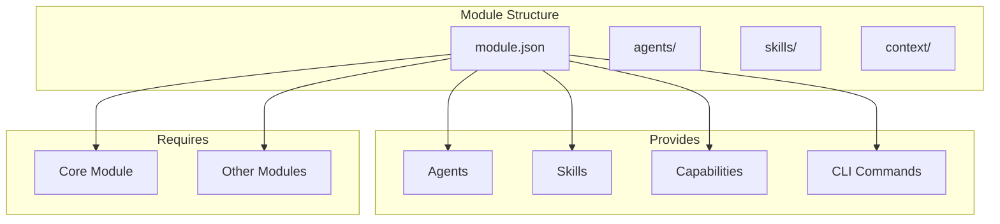
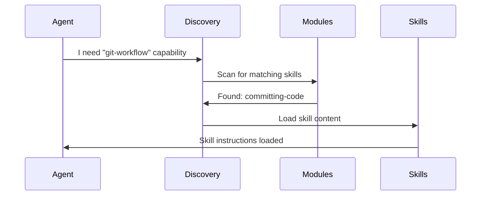
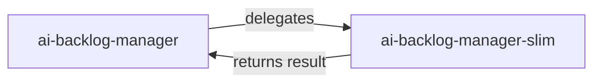

# Architecture Overview

This document explains how the Agentic Development Framework is structured and how its components interact.

## Core Concepts

The framework is built on four key concepts:

| Concept | Purpose | Example |
|---------|---------|---------|
| **Modules** | Composable capability packages | `core`, `backlog`, `jira` |
| **Agents** | AI personas with specific roles | `ai-backlog-manager`, `ai-architect` |
| **Skills** | Reusable workflows and knowledge | `committing-code`, `organizing-backlog` |
| **Discovery Engine** | Auto-routes agents to skills | capability-needs → skills |

## Module System

Modules are self-contained packages that provide agents, skills, and CLI commands. Each module declares what it provides and what it requires.



### Module Manifest (module.json)

Every module has a `module.json` that declares:

```json
{
  "id": "backlog",
  "version": "1.0.0",
  "provides": {
    "agents": ["ai-backlog-manager"],
    "skills": ["organizing-backlog"],
    "capabilities": ["ticket-decomposition", "epic-breakdown"],
    "cli-commands": ["backlog create-ticket"]
  },
  "requires": {
    "core": ">=1.0.0"
  }
}
```

### Module Dependencies

Modules can declare required and optional dependencies:

- **Required (`requires`)**: Module won't install without these
- **Optional (`optional-dependencies`)**: Enhanced features when present

```
core ← backlog ← jira
  ↑        ↑
  └── coding
        ↑
   confluence
```

## Discovery Engine

The Discovery Engine automatically connects agents to skills based on capabilities. No hardcoded dependencies required.



### How Discovery Works

1. **Agent declares needs** in YAML frontmatter:
   ```yaml
   capability-needs:
     - git-workflow
     - quality-assurance
   ```

2. **Skills declare provisions** in YAML frontmatter:
   ```yaml
   capabilities-provided:
     - git-workflow
   ```

3. **Discovery Engine matches** capability-needs to capabilities-provided
4. **Skills are loaded** on-demand when agent is invoked

### Benefits

- **Loose coupling**: Agents don't know which skills exist
- **Extensibility**: Add new skills without modifying agents
- **Composability**: Install only the modules you need

## File Structure

```
project/
├── .claude/
│   ├── commands/          # Agents as slash commands
│   └── skills/            # Skills for Claude Code
├── .claude/
│   ├── agents/            # Agent markdown files
│   ├── skills/            # Skill directories
│   ├── context/           # Context files (business, technical, process)
│   └── registries/        # Discovery metadata
├── CLAUDE.md              # Entry point
└── routes.yml             # Filesystem navigation
```

### Why This Structure?

| Directory | Purpose | Rationale |
|-----------|---------|-----------|
| `.claude/` | Claude Code integration | IDE recognizes this for slash commands |
| `.claude/commands/` | Agent prompts | Grouped with AI content, not source code |
| `.claude/skills/` | Skill docs | Progressive disclosure (SKILL.md + supporting files) |
| `.claude/context/` | Domain knowledge | Loaded based on agent's context-category-needs |
| `.claude/registries/` | Discovery metadata | JSON files for programmatic access |

### Framework vs Project

The framework (`framework/`) contains source modules. Projects receive deployed copies:

```
framework/modules/backlog/      →  project/.claude/skills/backlog/*
                agents/         →  project/.claude/commands/
                                    project/.claude/agents/
```

## Deployment Architecture

The framework uses `SyncEngine` as the single deployment mechanism for all CLI commands. This ensures consistent file placement and prevents orphaned files.

### Deployment Mechanism

| Command | Uses SyncEngine | Target Directory | Status |
|---------|----------------|------------------|--------|
| `init` | ✅ | `.claude/` only | Correct |
| `sync` | ✅ | `.claude/` only | Correct |
| `add` | ✅ | `.claude/` only | Correct |
| `update` | ✅ | `.claude/` only | Correct |
| `remove` | ✅ | `.claude/` only | Correct |

### Deployment Targets

| File Type | Source Location | Deployment Target | Notes |
|-----------|----------------|-------------------|-------|
| Agents | `module/agents/ai-*.md` | `.claude/commands/` + `.claude/agents/` | Slash commands + Task tool |
| Skills | `module/skills/*/SKILL.md` | `.claude/skills/` | Flattened structure |
| Commands | `module/commands/cmd-*.md` | `.claude/commands/` | CLI wrappers |
| Hooks | `module/hooks/*.sh` | `.claude/hooks/` | Event handlers |

### Important Notes

- **All files deploy to `.claude/` only** - The `ai/` directory pattern is deprecated
- **SyncEngine handles link transformation** - Markdown links are updated during deployment
- **No orphaned files** - Shared deployment engine ensures consistency across all commands
- **Idempotent operations** - Running sync/add multiple times produces the same result

## Context System

Context files provide domain knowledge at three levels:

| Level | Files Loaded | Use Case |
|-------|-------------|----------|
| `basic` | `*-basic.md` | Day-to-day tasks (~500 tokens) |
| `advanced` | `*-basic.md` + `*-advanced.md` | Complex tasks (~1500 tokens) |
| `expert` | All three | Strategic decisions (~3000 tokens) |

Categories: `business`, `technical`, `process`

### Context Loading

Agents declare what context they need:

```yaml
context-category-needs:
  business: basic
  technical: advanced
  process: basic
```

The Discovery Engine loads matching context files automatically.

## Agent Variants

Agents come in two variants for token efficiency:

| Variant | Token Budget | Context Level | Use Case |
|---------|-------------|---------------|----------|
| **Full** | ~2500 | advanced/expert | Orchestration, complex decisions |
| **Slim** | ~1000 | basic only | Focused single-task execution |

Full agents can delegate to slim variants:



## Routes.yml

The `routes.yml` file provides filesystem navigation without hardcoded paths:

```yaml
claude:
  commands: .claude/commands
  skills: .claude/skills
  context: .claude/context
  registries: .claude/registries
framework:
  modules: framework/modules
  cli: framework/cli
```

### Keeping Routes Updated

```bash
# Preview changes
agentic-framework routes sync --dry-run

# Apply synchronization
agentic-framework routes sync
```

## Registries

JSON registries in `.claude/registries/` provide programmatic access to metadata:

| Registry | Purpose |
|----------|---------|
| `agents.json` | Agent definitions, capability-needs |
| `skills.json` | Skill definitions, capabilities-provided |
| `modules.json` | Installed modules |

These are generated during module installation and kept in sync.

## See Also

- [Getting Started](getting-started.md) - Initialize a project
- [Module Development](module-development.md) - Create new modules
- [CLI Reference](cli-reference.md) - Command documentation
