# Research: Markdown Build & Validation Systems for AI Agents

## Executive Summary

This document analyzes existing market solutions for building and validating markdown-based configuration files, specifically in the context of AI agent frameworks. The goal is to identify approaches that could provide "compile-time" validation for our markdown files with YAML frontmatter, similar to how source code is validated before execution.

### Key Findings

| Approach | Best For | Implementation Effort | Recommendation |
|----------|----------|----------------------|----------------|
| **zod-matter** | Quick wins, schema validation | Low | **Recommended: Phase 1** |
| **lychee** | Link validation in CI | Low | **Recommended: Phase 1** |
| **remark ecosystem** | Extensible markdown processing | Medium | Consider for Phase 2 |
| **AgentMark** | Full MDX-based agent systems | High | Watch & learn patterns |
| **Astro Content Collections** | Static site generation | Medium | Inspiration only |
| **Custom Build Command** | Full framework integration | High | **Recommended: Phase 2** |

---

## Current State Analysis

### What We Have Today

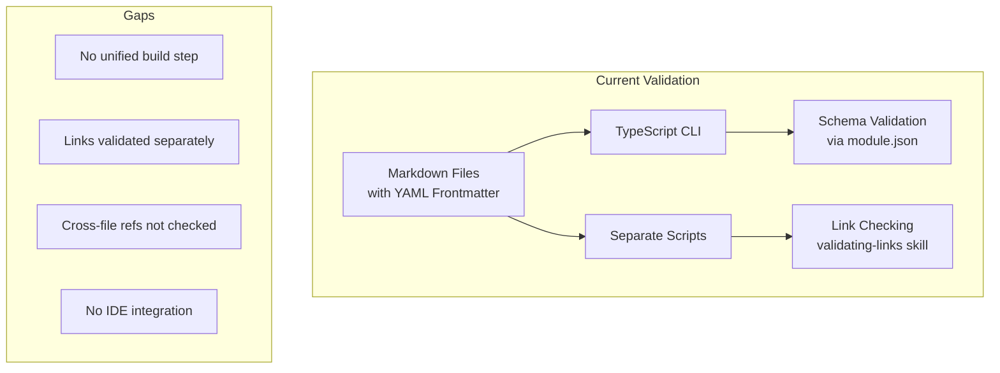

### Current Validation Points

| What | How | When | Gap |
|------|-----|------|-----|
| YAML syntax | CLI parse attempt | Manual/CI | No schema validation |
| JSON schemas | `module.schema.json` | CLI validate | Limited to module.json |
| Link validity | `validating-links` skill | Manual invocation | Not automated |
| Cross-references | None | Never | Skills→Agents, Context→Categories |

### The Vision: Compiler-Like Experience

```
$ agentic-framework build

Compiling framework artifacts...

ERROR ai-architect.md:15:3
  Field 'capability-needs' contains unknown capability 'architecture-design'
  Available capabilities: system-architecture, api-design, data-modeling

ERROR ai-backlog-manager.md:45:1
  Broken internal link: './skills/organizing-backlog/SKILL.md'
  File does not exist at: ai/skills/backlog/organizing-backlog/SKILL.md

WARNING committing-code/SKILL.md:23:1
  External link may be outdated: https://docs.github.com/en/deprecated-api
  Last checked: 2025-12-01, Status: 301 Redirect

✗ Build failed: 2 errors, 1 warning
```

---

## Detailed Analysis of Market Approaches

---

### 1. AgentMark

**Source:** [github.com/agentmark-ai/agentmark](https://github.com/agentmark-ai/agentmark)

#### Description

AgentMark is purpose-built for AI prompt engineering. It extends Markdown with MDX (Markdown + JSX), providing schema validation, type generation, and a CLI for running prompts.

Key philosophy: "Markdown for the AI era" - treating prompts as first-class artifacts with compile-time guarantees.

#### Example

```mdx
---
name: analyze-code
description: Analyze code for issues
model: claude-sonnet-4-20250514
input:
  type: object
  properties:
    code:
      type: string
      description: The code to analyze
    language:
      type: string
      enum: [typescript, python, go]
  required: [code, language]
output:
  type: object
  properties:
    issues:
      type: array
      items:
        type: object
        properties:
          line: { type: number }
          severity: { type: string, enum: [error, warning, info] }
          message: { type: string }
---

Analyze the following {props.language} code for issues:

```{props.language}
{props.code}
```

Return a structured list of issues found.
```

**Run with CLI:**
```bash
agentmark run analyze-code.prompt.mdx --input '{"code": "...", "language": "typescript"}'
```

#### Integration Diagram

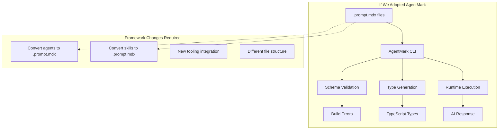

#### Evaluation

| Criterion | Score (1-5) | Notes |
|-----------|-------------|-------|
| **Usefulness** | 5 | Exactly solves the problem |
| **Implementation Difficulty** | 4 | Requires format migration |
| **Maintenance Burden** | 3 | External dependency, active project |
| **Framework Fit** | 2 | Different paradigm than current approach |

#### Judgment

AgentMark is the most feature-complete solution for AI prompt validation. However, adopting it would require significant changes to our framework:

- **Pros:**
  - Purpose-built for AI agents
  - JSON Schema validation built-in
  - TypeScript type generation
  - Active development (2025)
  - SDK integrations (Vercel AI, Mastra)

- **Cons:**
  - Requires migration to MDX format
  - Different file structure expectations
  - New dependency with its own opinions
  - Our agents are more complex than simple prompts

**Recommendation:** Watch this project and adopt patterns, but don't migrate wholesale. Key patterns to learn:
- Schema-in-frontmatter approach
- CLI-based validation
- Type generation from schemas

---

### 2. Astro Content Collections + Zod

**Source:** [docs.astro.build/en/guides/content-collections](https://docs.astro.build/en/guides/content-collections/)

#### Description

Astro's Content Collections provide type-safe markdown handling through Zod schema definitions. Frontmatter is validated at build time, with automatic TypeScript type generation.

While Astro is a web framework, its content validation pattern is highly applicable.

#### Example

**Define schema (src/content/config.ts):**
```typescript
import { defineCollection, z } from 'astro:content';

const agents = defineCollection({
  type: 'content',
  schema: z.object({
    name: z.string().regex(/^ai-/, 'Agent names must start with "ai-"'),
    description: z.string().min(20).max(200),
    variant: z.enum(['full', 'slim']).default('full'),
    'capability-needs': z.array(z.string()).min(1),
    'context-category-needs': z.record(
      z.enum(['business', 'technical', 'process']),
      z.enum(['basic', 'advanced', 'expert'])
    ),
    'token-budget': z.number().int().min(500).max(5000),
    'delegates-to': z.array(z.string()).optional(),
  }),
});

const skills = defineCollection({
  type: 'content',
  schema: z.object({
    name: z.string(),
    description: z.string(),
    'capabilities-provided': z.array(z.string()).min(1),
    'cli-commands': z.record(z.object({
      command: z.string(),
      description: z.string(),
      template: z.string().optional(),
    })).optional(),
  }),
});

export const collections = { agents, skills };
```

**Markdown file (src/content/agents/ai-architect.md):**
```yaml
---
name: ai-architect
description: Designs system architecture and makes technical decisions
variant: full
capability-needs:
  - system-architecture
  - api-design
context-category-needs:
  technical: expert
  business: basic
token-budget: 2500
---

# Architect Agent

...agent content...
```

**Build output:**
```
$ astro build

▶ Building content collections...
  ✓ agents: 12 entries validated
  ✓ skills: 8 entries validated

▶ Generating types...
  ✓ .astro/types.d.ts updated

ERROR src/content/agents/ai-broken.md
  Invalid frontmatter:
    - capability-needs: Array must contain at least 1 element(s)
    - token-budget: Expected number, received string
```

#### Integration Diagram

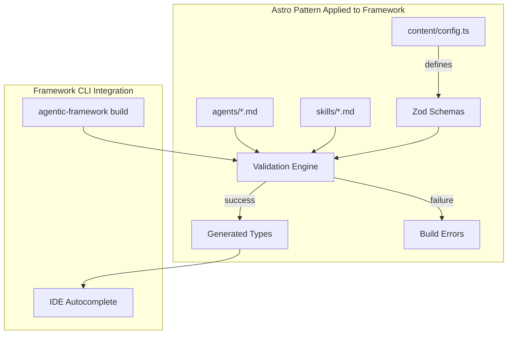

#### Evaluation

| Criterion | Score (1-5) | Notes |
|-----------|-------------|-------|
| **Usefulness** | 5 | Exactly what we need |
| **Implementation Difficulty** | 3 | Can extract pattern without Astro |
| **Maintenance Burden** | 2 | Zod is stable, pattern is simple |
| **Framework Fit** | 4 | Aligns well with current structure |

#### Judgment

Astro's pattern is highly applicable. We don't need Astro itself, just the pattern:
1. Define Zod schemas for each content type
2. Validate markdown frontmatter against schemas
3. Generate TypeScript types for IDE support

**Recommendation:** **Adopt this pattern**. Implement a `content/config.ts` equivalent in our CLI that defines schemas for agents, skills, and context files.

---

### 3. zod-matter

**Source:** [github.com/HiDeoo/zod-matter](https://github.com/HiDeoo/zod-matter)

#### Description

A lightweight library that combines gray-matter (YAML frontmatter parsing) with Zod validation. Simple, focused, and easy to integrate.

#### Example

**Installation:**
```bash
npm install zod-matter zod gray-matter
```

**Usage in CLI validator:**
```typescript
import { matter } from 'zod-matter';
import { z } from 'zod';
import { readFileSync } from 'fs';
import { glob } from 'glob';

// Define schema
const agentSchema = z.object({
  name: z.string().regex(/^ai-/),
  description: z.string(),
  variant: z.enum(['full', 'slim']).optional().default('full'),
  'capability-needs': z.array(z.string()),
  'context-category-needs': z.record(
    z.enum(['business', 'technical', 'process']),
    z.enum(['basic', 'advanced', 'expert'])
  ).optional(),
  'token-budget': z.number().optional(),
});

// Validate all agents
const agentFiles = glob.sync('ai/agents/*.md');
const errors: string[] = [];

for (const file of agentFiles) {
  const content = readFileSync(file, 'utf-8');
  try {
    const { data, content: body } = matter(content, { schema: agentSchema });
    console.log(`✓ ${file}: Valid`);
  } catch (error) {
    if (error instanceof z.ZodError) {
      errors.push(`✗ ${file}:\n${error.errors.map(e =>
        `  - ${e.path.join('.')}: ${e.message}`
      ).join('\n')}`);
    }
  }
}

if (errors.length > 0) {
  console.error('\nValidation failed:\n');
  errors.forEach(e => console.error(e));
  process.exit(1);
}
```

**Output:**
```
$ npx ts-node validate-agents.ts

✓ ai/agents/ai-architect.md: Valid
✓ ai/agents/ai-planning-manager.md: Valid
✗ ai/agents/ai-broken.md:
  - capability-needs: Required
  - token-budget: Expected number, received string

Validation failed: 1 error
```

#### Integration Diagram

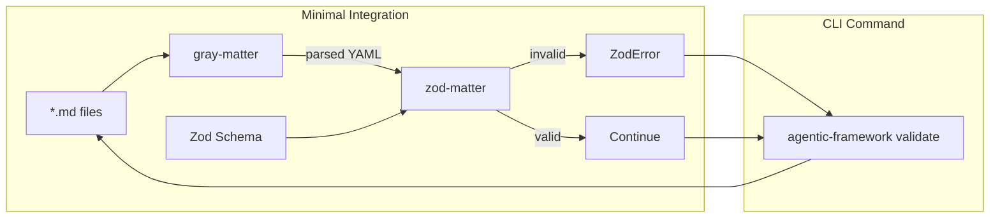

#### Evaluation

| Criterion | Score (1-5) | Notes |
|-----------|-------------|-------|
| **Usefulness** | 4 | Solves schema validation well |
| **Implementation Difficulty** | 1 | ~50 lines of code |
| **Maintenance Burden** | 1 | Minimal, stable dependencies |
| **Framework Fit** | 5 | Drop-in addition to existing CLI |

#### Judgment

This is the **lowest-effort, highest-value** option for immediate implementation. It provides:
- Schema validation for frontmatter
- Type inference from schemas
- Clear error messages
- Zero architecture changes

**Recommendation:** **Implement immediately** as `agentic-framework validate --schema`. This is Phase 1.

---

### 4. remark/unified Ecosystem

**Source:** [github.com/remarkjs/remark-lint](https://github.com/remarkjs/remark-lint)

#### Description

The unified.js ecosystem provides a complete pipeline for processing markdown:
- **remark**: Markdown processor
- **remark-frontmatter**: Parse YAML frontmatter
- **remark-lint**: Linting rules
- **remark-lint-frontmatter-schema**: JSON Schema validation for frontmatter
- **remark-validate-links**: Check internal/external links

This is an industrial-strength solution used by many documentation systems.

#### Example

**Pipeline setup:**
```typescript
import { unified } from 'unified';
import remarkParse from 'remark-parse';
import remarkFrontmatter from 'remark-frontmatter';
import remarkLintFrontmatterSchema from 'remark-lint-frontmatter-schema';
import remarkValidateLinks from 'remark-validate-links';
import remarkLint from 'remark-lint';
import { reporter } from 'vfile-reporter';

// JSON Schema for agents (remark uses JSON Schema, not Zod)
const agentSchema = {
  type: 'object',
  required: ['name', 'capability-needs'],
  properties: {
    name: { type: 'string', pattern: '^ai-' },
    'capability-needs': {
      type: 'array',
      items: { type: 'string' },
      minItems: 1
    },
    'token-budget': { type: 'number', maximum: 5000 }
  }
};

const processor = unified()
  .use(remarkParse)
  .use(remarkFrontmatter, ['yaml'])
  .use(remarkLintFrontmatterSchema, {
    schemas: {
      'ai/agents/*.md': agentSchema
    }
  })
  .use(remarkValidateLinks)
  .use(remarkLint);

// Process file
const file = await processor.process(
  await read('ai/agents/ai-architect.md')
);

console.log(reporter(file));
```

**Output:**
```
ai/agents/ai-broken.md
  1:1  error  Frontmatter invalid: capability-needs is required
  45:1 error  Link to unknown file `./missing-skill.md`

2 errors
```

#### Integration Diagram

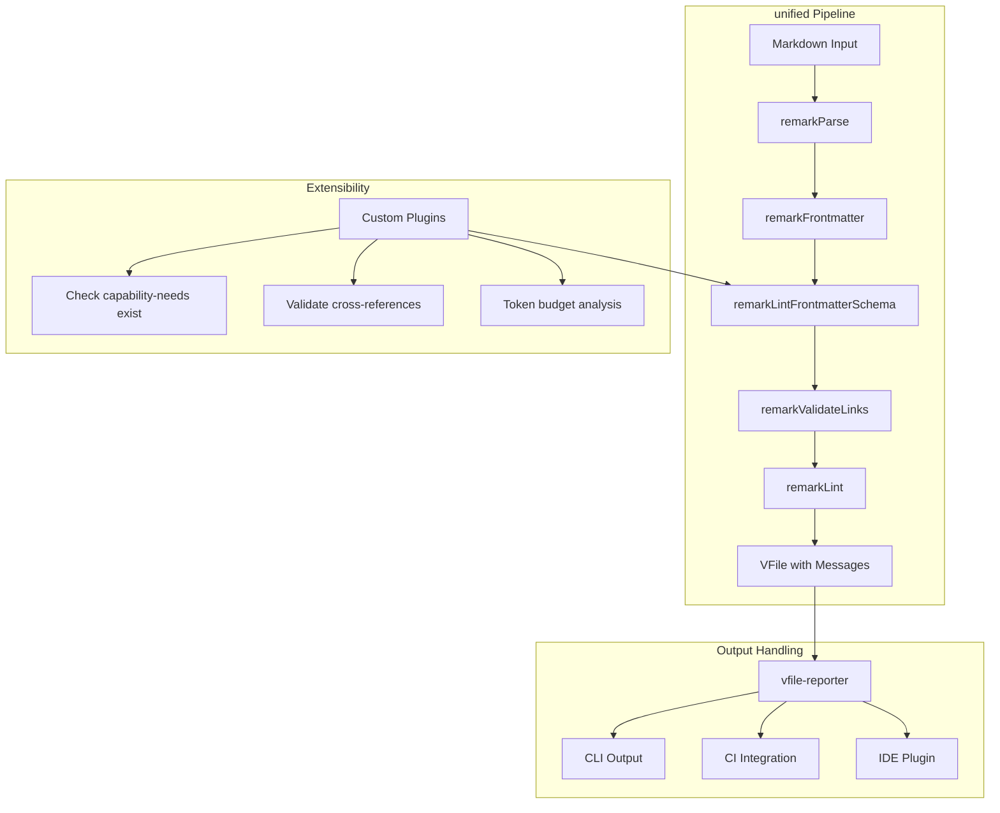

#### Evaluation

| Criterion | Score (1-5) | Notes |
|-----------|-------------|-------|
| **Usefulness** | 5 | Complete solution |
| **Implementation Difficulty** | 3 | Learning curve for unified ecosystem |
| **Maintenance Burden** | 3 | Many dependencies, but stable ecosystem |
| **Framework Fit** | 4 | Well-suited, requires pipeline setup |

#### Judgment

The remark ecosystem is powerful and extensible. Key advantages:
- Unified pipeline for all markdown processing
- Plugin ecosystem for custom rules
- VFile format integrates with many tools
- Can write custom plugins for framework-specific validation

Key concerns:
- Uses JSON Schema (not Zod) for frontmatter validation
- Learning curve for unified's AST-based approach
- More dependencies than simpler solutions

**Recommendation:** **Consider for Phase 2** when we need:
- Custom validation rules
- Markdown content analysis (not just frontmatter)
- Integration with existing unified-based tools

---

### 5. Link Validation Tools

**Sources:**
- [lychee](https://github.com/lycheeverse/lychee-action) - Rust, fastest
- [markdown-link-check](https://github.com/tcort/markdown-link-check) - Node.js, popular
- [mlc](https://github.com/becheran/mlc) - Rust, simple

#### Description

Dedicated tools for checking links in markdown files. Can validate:
- Internal file links
- External URLs (with HTTP HEAD requests)
- Anchor links within documents

#### Example: lychee

**GitHub Action:**
```yaml
name: Link Validation
on: [push, pull_request]

jobs:
  link-check:
    runs-on: ubuntu-latest
    steps:
      - uses: actions/checkout@v4

      - name: Check links
        uses: lycheeverse/lychee-action@v2
        with:
          args: |
            --verbose
            --no-progress
            --exclude-path node_modules
            --exclude 'https://example\.com'
            '**/*.md'
          fail: true
```

**Local usage:**
```bash
# Install
brew install lychee  # or cargo install lychee

# Run
lychee --verbose 'ai/**/*.md' 'docs/**/*.md'
```

**Output:**
```
[200] https://github.com/anthropics/claude-code
[200] ./skills/committing-code/SKILL.md
[404] ./skills/missing-skill/SKILL.md
[ERR] https://docs.example.com/deprecated (Connection refused)

Checked: 156 links
Successful: 153
Failed: 2
Excluded: 1
```

#### Comparison of Tools

| Tool | Language | Speed | Features | CI Integration |
|------|----------|-------|----------|----------------|
| **lychee** | Rust | ★★★★★ | Caching, regex excludes, archive.org fallback | GitHub Action |
| **markdown-link-check** | Node.js | ★★★☆☆ | Config file, replacement patterns | GitHub Action |
| **mlc** | Rust | ★★★★☆ | Simple, offline mode | GitHub Action |

#### Integration Diagram

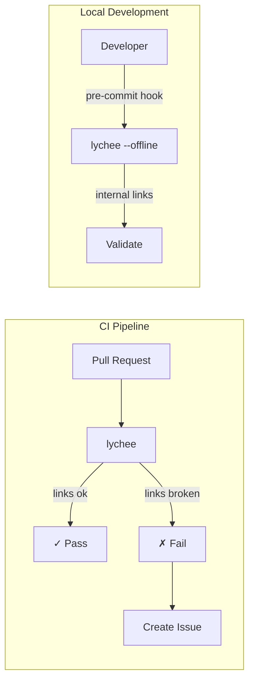

#### Evaluation

| Criterion | Score (1-5) | Notes |
|-----------|-------------|-------|
| **Usefulness** | 4 | Solves link validation well |
| **Implementation Difficulty** | 1 | Just add to CI |
| **Maintenance Burden** | 1 | Standalone tool, minimal config |
| **Framework Fit** | 5 | Complements existing validation |

#### Judgment

Link validation tools are mature and easy to adopt. lychee is the clear winner:
- Fastest (Rust, async)
- Best GitHub Action support
- Smart caching
- Regex excludes for flaky URLs

**Recommendation:** **Implement immediately** alongside zod-matter. Add to CI pipeline and provide local command.

---

### 6. Liman - Declarative YAML Agentic Framework

**Source:** [liman-ai.dev](https://www.liman-ai.dev/blog/2025-07-30_intro)

#### Description

Liman takes a different approach: instead of markdown with YAML frontmatter, it uses pure YAML with a custom DSL for agent definitions. Claims to be "what OpenAPI did for APIs, but for agents."

#### Example

```yaml
# agent.liman.yaml
name: code-reviewer
version: 1.0.0

nodes:
  analyze:
    type: llm
    model: claude-sonnet-4-20250514
    prompt: |
      Analyze this code for issues:
      {{ input.code }}

  format:
    type: transform
    input: analyze.output
    template: |
      ## Review Results
      {{ for issue in issues }}
      - **{{ issue.severity }}**: {{ issue.message }}
      {{ endfor }}

edges:
  - from: analyze
    to: format
    condition: $len(analyze.issues) > 0

  - from: analyze
    to: $end
    condition: $len(analyze.issues) == 0

# DSL CE (Condition Expression) examples
# $len() - length function
# $contains() - string contains
# $state.variable - access state
```

#### Integration Diagram

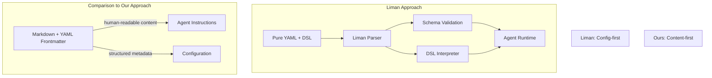

#### Evaluation

| Criterion | Score (1-5) | Notes |
|-----------|-------------|-------|
| **Usefulness** | 3 | Interesting patterns, different paradigm |
| **Implementation Difficulty** | 5 | Would require framework rewrite |
| **Maintenance Burden** | 4 | New DSL to maintain |
| **Framework Fit** | 1 | Fundamentally different approach |

#### Judgment

Liman solves a different problem. It's configuration-first, while our framework is content-first. Our agents are primarily prose instructions with structured metadata, not workflow graphs.

Interesting patterns to learn:
- Custom DSL for conditions (we could use for capability matching)
- Manifest-based validation
- Graph visualization of agent flows

**Recommendation:** **Don't adopt**, but monitor for ideas. Our markdown-first approach is better suited for AI agent instructions that are primarily natural language.

---

### 7. Microsoft TypeSpec

**Source:** [TypeSpec for M365 Copilot](https://www.voitanos.io/blog/microsoft-365-copilot-declarative-agent-typespec-101/)

#### Description

Microsoft's TypeSpec is a language for defining APIs and configurations with strong typing. They're extending it for AI agent definitions in M365 Copilot.

#### Example

```typespec
// agent.tsp
import "@typespec/agent";

@agent
model CodeReviewer {
  @description("Reviews code for issues")
  name: "code-reviewer";

  capabilities: [
    Capability.CodeAnalysis,
    Capability.SecurityScanning
  ];

  @minValue(500)
  @maxValue(5000)
  tokenBudget: int32 = 2500;

  instructions: """
    You are a code reviewer. Analyze code for:
    - Security vulnerabilities
    - Performance issues
    - Best practice violations
  """;
}

// Compiles to JSON/YAML
```

**Compilation:**
```bash
tsp compile agent.tsp --emit @typespec/json-schema
```

**Output (agent.json):**
```json
{
  "name": "code-reviewer",
  "capabilities": ["CodeAnalysis", "SecurityScanning"],
  "tokenBudget": 2500,
  "instructions": "You are a code reviewer..."
}
```

#### Integration Diagram

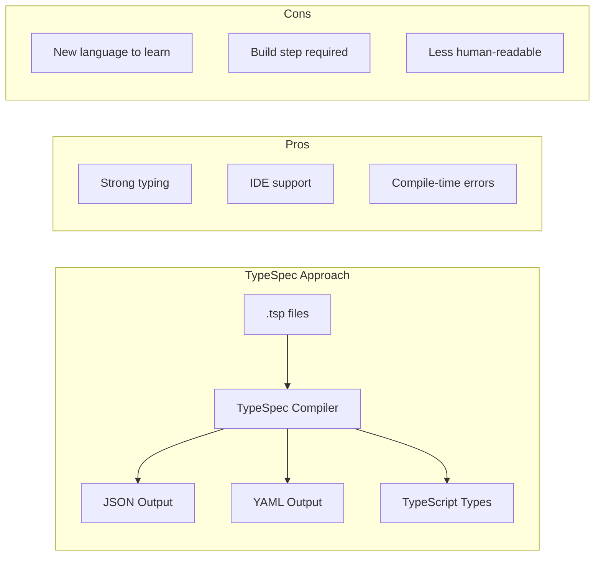

#### Evaluation

| Criterion | Score (1-5) | Notes |
|-----------|-------------|-------|
| **Usefulness** | 3 | Interesting for schema generation |
| **Implementation Difficulty** | 5 | New language, significant investment |
| **Maintenance Burden** | 4 | TypeSpec has Microsoft backing |
| **Framework Fit** | 2 | Overkill for our needs |

#### Judgment

TypeSpec is enterprise-grade tooling for API definitions. While powerful, it's overkill for our framework:
- Our agents are primarily prose, not schema
- Learning curve is significant
- Microsoft-ecosystem focused

**Recommendation:** **Don't adopt**. Interesting for enterprises defining hundreds of agents with strict contracts, but our markdown-first approach is simpler and more appropriate.

---

## Comparison Matrix

### Feature Comparison

| Feature | zod-matter | remark | AgentMark | lychee | Liman | TypeSpec |
|---------|------------|--------|-----------|--------|-------|----------|
| Schema Validation | ✓ Zod | ✓ JSON Schema | ✓ JSON Schema | ✗ | ✓ YAML | ✓ Native |
| Link Checking | ✗ | ✓ Plugin | ✗ | ✓ | ✗ | ✗ |
| Type Generation | ✓ Via Zod | ✗ | ✓ | ✗ | ✗ | ✓ |
| Custom Rules | ✓ Zod refinements | ✓ Plugins | ✓ JSX | ✗ | ✓ DSL | ✓ Decorators |
| IDE Support | ✓ Via types | ✗ | ✓ | ✗ | ✗ | ✓ |
| CI Integration | Manual | VFile | CLI | GitHub Action | ✗ | CLI |
| Learning Curve | Low | Medium | Medium | Low | High | High |

### Effort vs Impact

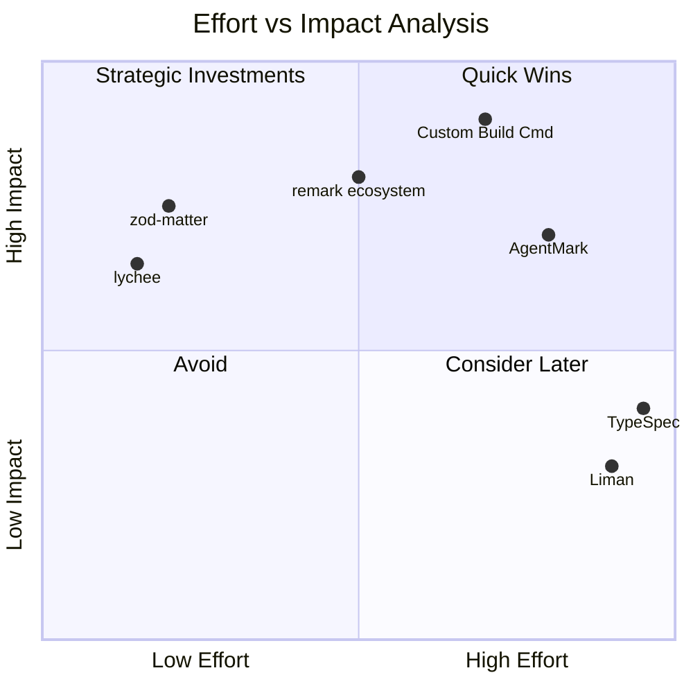

---

## Recommended Implementation Roadmap

### Phase 1: Quick Wins (1-2 days)

**Goal:** Immediate validation improvements with minimal effort.

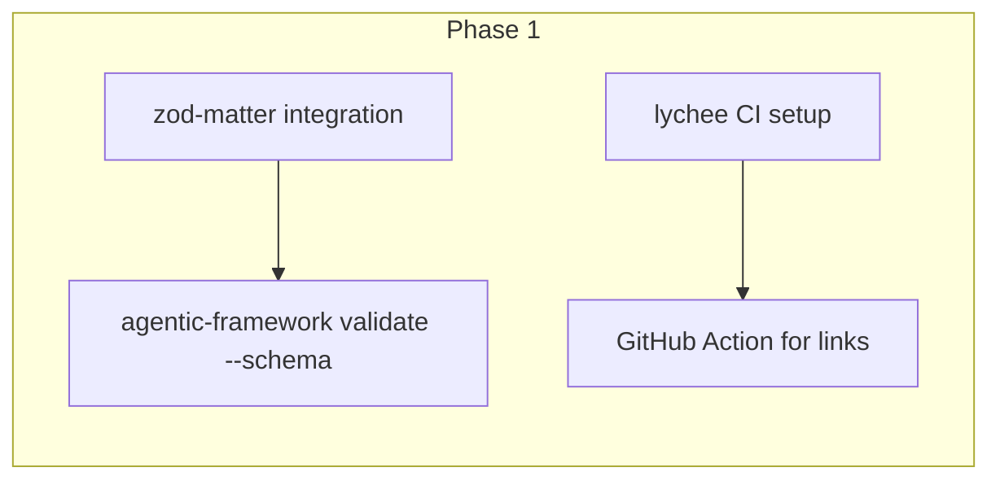

**Deliverables:**
1. Add `zod` and `zod-matter` to CLI dependencies
2. Define Zod schemas for agents, skills, context files
3. New CLI command: `agentic-framework validate --schema`
4. Add lychee GitHub Action for link checking

**Example Schema (framework/cli/src/schemas/agent.ts):**
```typescript
import { z } from 'zod';

export const agentSchema = z.object({
  name: z.string().regex(/^ai-/, 'Agent name must start with "ai-"'),
  description: z.string().min(20).max(300),
  variant: z.enum(['full', 'slim']).optional().default('full'),
  'capability-needs': z.array(z.string()).min(1),
  'context-category-needs': z.record(
    z.enum(['business', 'technical', 'process']),
    z.enum(['basic', 'advanced', 'expert'])
  ).optional(),
  'token-budget': z.number().int().min(500).max(5000).optional(),
  'delegates-to': z.array(z.string()).optional(),
});

export type Agent = z.infer<typeof agentSchema>;
```

---

### Phase 2: Unified Build Command (1 week)

**Goal:** Single command that validates everything with compiler-like experience.

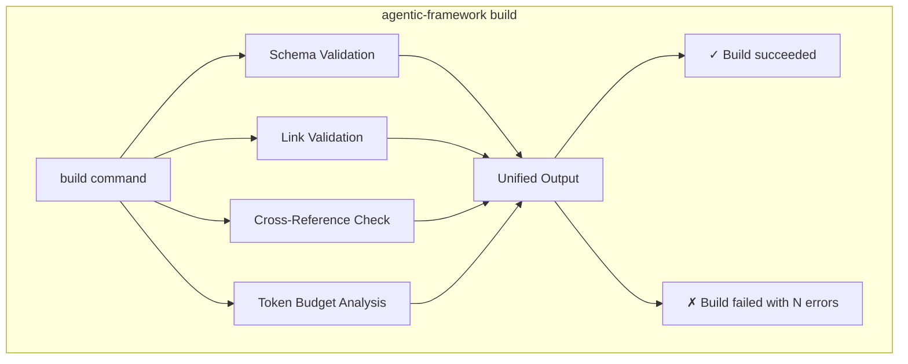

**Deliverables:**
1. New CLI command: `agentic-framework build`
2. Cross-reference validation (capabilities exist, skills resolve)
3. Unified error reporting format
4. Optional: Generate TypeScript types from schemas

**Cross-Reference Validation Example:**
```typescript
// Validate that all capability-needs have matching capabilities-provided
function validateCapabilityReferences(
  agents: Agent[],
  skills: Skill[]
): ValidationError[] {
  const providedCapabilities = new Set(
    skills.flatMap(s => s['capabilities-provided'])
  );

  const errors: ValidationError[] = [];

  for (const agent of agents) {
    for (const need of agent['capability-needs']) {
      if (!providedCapabilities.has(need)) {
        errors.push({
          file: agent._file,
          line: agent._capabilityNeedsLine,
          message: `Unknown capability '${need}'`,
          suggestion: `Available: ${[...providedCapabilities].join(', ')}`,
        });
      }
    }
  }

  return errors;
}
```

---

### Phase 3: IDE Integration (optional, 2 weeks)

**Goal:** Real-time validation in VSCode/editors.

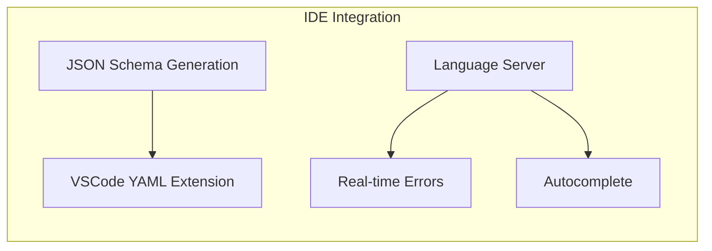

**Deliverables:**
1. Generate JSON Schemas from Zod schemas
2. Configure VSCode YAML extension to use schemas
3. Optional: Custom language server for advanced features

---

## Conclusion

### What To Do Now

1. **Implement zod-matter validation** - Low effort, high value
2. **Add lychee to CI** - Solves link checking immediately
3. **Design build command spec** - Plan the unified experience

### What To Watch

1. **AgentMark** - May become the standard for AI prompt files
2. **remark ecosystem** - If we need custom markdown rules
3. **Astro patterns** - Best practices for content schemas

### What To Avoid

1. **Liman/TypeSpec** - Different paradigms, not worth migration cost
2. **Building custom DSL** - Maintenance burden not justified
3. **Over-engineering** - Start simple, add complexity when needed

---

## References

- [AgentMark GitHub](https://github.com/agentmark-ai/agentmark)
- [Astro Content Collections](https://docs.astro.build/en/guides/content-collections/)
- [zod-matter](https://github.com/HiDeoo/zod-matter)
- [remark-lint](https://github.com/remarkjs/remark-lint)
- [remark-lint-frontmatter-schema](https://github.com/JulianCataldo/remark-lint-frontmatter-schema)
- [lychee](https://github.com/lycheeverse/lychee-action)
- [Liman Framework](https://www.liman-ai.dev/blog/2025-07-30_intro)
- [TypeSpec for M365 Copilot](https://www.voitanos.io/blog/microsoft-365-copilot-declarative-agent-typespec-101/)
- [Claude Code Best Practices](https://www.anthropic.com/engineering/claude-code-best-practices)
- [GitHub: How to write a great agents.md](https://github.blog/ai-and-ml/github-copilot/how-to-write-a-great-agents-md-lessons-from-over-2500-repositories/)

---

*Document created: 2025-12-27*
*Framework version: 1.2.0*
